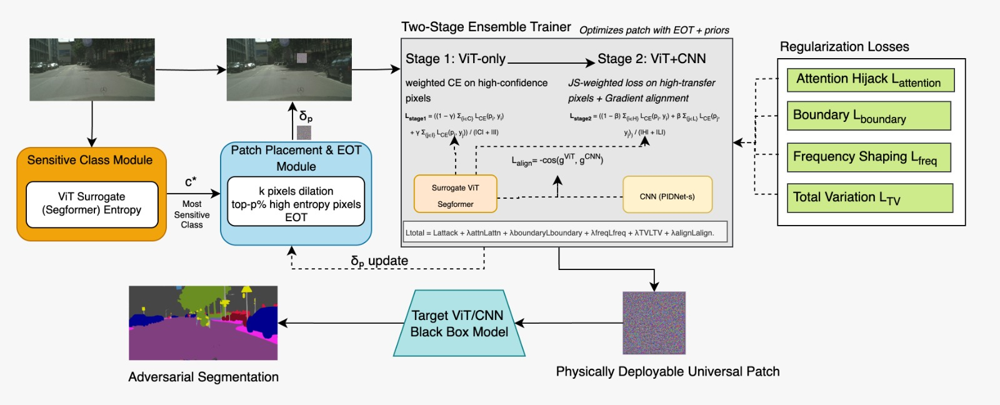

# TransPatch: Universal Adversarial Patch for Cross‑Architecture Transfer in Semantic Segmentation

<p align="center">
  
  &nbsp;&nbsp;
  
  &nbsp;&nbsp;
  
</p>

<p align="center">
  <a href="https://img.shields.io/badge/AAAI'26-Student%20Abstract%20Accepted-blue"></a>
  <a href="#license"></a>
  <a href="#citation"></a>
</p>

**TL;DR.** *TransPatch* learns a **single, physically‑deployable adversarial patch** that **generalizes across images and both ViT and CNN segmentation models**, without access to target weights. It uses **sensitive‑region placement**, a **two‑stage ViT→CNN curriculum with gradient alignment**, and **lightweight priors** (attention hijack, boundary, frequency, TV) to maximize **black‑box transferability**.

---

## Repository Structure


```
.
├─ Experiments/                # Experiment entrypoints & evaluation scripts
├─ configs/                    # YAML configs for models, training, datasets
├─ dataset/                    # Data loaders & preparation utilities
├─ greedy_patch/               # Greedy/heuristic patch baselines
├─ metrics/                    # mIoU and other evaluation metrics
├─ patch/                      # Patch parameterization, priors, EOT
├─ pretrained_models/          # Pretrained backbones / checkpoints
├─ trainer/                    # Training loops & curricula
│  └─ trainer_TranSegPGD_AdvPatch.py  # Main trainer (TransPatch)
├─ utils/                      # Common utilities (logging, seed, viz)
├─ notebooks/                  # Reproducible runs (Kaggle/Colab)
│  ├─ adversarial-patch-baseline.ipynb
│  └─ adv-patch-evaluation-transferability.ipynb
├─ paper/                      
└─ README.md
```

---

## Methodology Overview

<p align="center">
  
</p>

1. **Sensitive‑region placement** using predictive entropy → place the patch on **high‑uncertainty semantic regions** (e.g., *pole* in Cityscapes).
2. **Two‑stage training**: **Stage‑1 (ViT‑only)** to destabilize global attention; **Stage‑2 (ViT+CNN ensemble)** with **JS‑divergence mining** and **gradient alignment** for transfer.
3. **Attention hijack + Priors**: increase attention mass on the patch while keeping it **compact, smooth, and physically realizable** by using boundary/frequency/TV constraints.
4. **EOT** (random scale/rotate/translate) for **physical robustness**.

> See `patch/` (priors) and `trainer/trainer_TranSegPGD_AdvPatch.py` for the full implementation.

---

## Setup

### 1) Environment

```bash
# Conda (recommended)
conda create -n transpatch python=3.10 -y
conda activate transpatch

# PyTorch (choose CUDA that matches your system)
pip install torch torchvision --index-url https://download.pytorch.org/whl/cu118

# Core dependencies
pip install -r requirements.txt   # (add this file if not present)
```

> If you don’t have `requirements.txt`, export your current environment:
> `pip freeze | grep -E "torch|torchvision|opencv|albumentations|tqdm|pyyaml|numpy|scipy|matplotlib" > requirements.txt`.

### 2) Data (Cityscapes)

* Download **Cityscapes** and set `CITYSCAPES_DIR=/path/to/cityscapes`.
* Expected structure (example):

```
CITYSCAPES_DIR/
  ├─ leftImg8bit/{train,val,test}/...
  └─ gtFine/{train,val,test}/...
```

* Update your config or pass `--data_root $CITYSCAPES_DIR` at runtime.

### 3) Pretrained Models

Place checkpoints in `pretrained_models/` (or set `--pretrained_dir`). Typical backbones used:

* **ViT surrogate**: SegFormer (e.g., `segformer_b2_cityscapes.pth`)
* **CNNs**: PIDNet‑S/M/L, BiSeNet‑V1/V2

---

## Quickstart

### A) Train TransPatch

Using the main trainer `trainer/trainer_TranSegPGD_AdvPatch.py`:

```bash
python -m trainer.trainer_TranSegPGD_AdvPatch \
  --data_root $CITYSCAPES_DIR \
  --out_dir runs/transpatch_cityscapes \
  --cfg configs/transpatch_cityscapes.yaml \
  --epochs 40 \
  --batch_size 8 \
  --lr 1e-3 \
  --vit segformer-b2 \
  --cnn pidnet-s pidnet-m bisenetv1 \
  --stage1_epochs 10 \
  --stage2_epochs 30 \
  --eot true \
  --patch_size 96 \
  --entropy_top_p 0.2 \
  --align_weight 0.1 \
  --prior_tv 1e-4 --prior_freq 1e-3 --prior_boundary 1e-3 --prior_attn 1e-2
```

**Notes**

* Replace models to match available checkpoints (e.g., `--cnn pidnet-l bisenetv2`).
* Hyperparameters above reflect a **sane default**; tune as needed (see `configs/`).
* Outputs: `runs/.../patch.pt`, logs, and visualizations.

### B) Evaluate Transferability

Evaluate a learned patch on **unseen** models:

```bash
python -m Experiments.eval_transfer \
  --data_root $CITYSCAPES_DIR \
  --patch_ckpt runs/transpatch_cityscapes/patch.pt \
  --models pidnet-s pidnet-m pidnet-l bisenetv1 bisenetv2 segformer-b2 \
  --metrics_dir runs/transpatch_cityscapes/metrics \
  --save_viz true
```

This computes **mIoU** and exports tables/plots under `metrics_dir`.

### C) Reproduce (Kaggle/Notebooks)

* `notebooks/adversarial-patch-baseline.ipynb` – minimal patch baseline and sanity checks.
* `notebooks/adv-patch-evaluation-transferability.ipynb` – batch evaluation and plots.

> If you trained on Kaggle, copy the **exact CLI cells** you used into the “Train” section above (for artifact reproducibility). Store results under `experiments/<date_tag>/...`.

---

## Results (Cityscapes, mIoU ↓)

| Model        | Random Patch mIoU | TransPatch mIoU (↓) | Drop (%) |
| ------------ | ----------------: | ------------------: | -------: |
| PIDNet‑S     |            0.8651 |              0.8148 |     5.81 |
| PIDNet‑M     |            0.8619 |              0.8127 |     5.71 |
| PIDNet‑L     |            0.8996 |              0.8445 |     6.09 |
| BiSeNet‑V1   |            0.7058 |              0.6784 |     3.88 |
| BiSeNet‑V2   |            0.6845 |              0.6530 |     4.60 |
| SegFormer‑B2 |            0.7674 |              0.7227 |     5.82 |

> Replicate via `Experiments/eval_transfer` with your `--patch_ckpt`.

---

## Configs & Reproducibility Tips

* Keep **all hyperparams** in `configs/*.yaml`; the trainer logs a copy to the run folder.
* Use `--seed 42` for deterministic runs when possible.
* Export environment summary: `python -m torch.utils.collect_env` → save to `runs/.../env.txt`.

---

## Testing & Sanity Checks

* **No‑patch baseline** and **random‑patch baseline**.
* **Attention hijack check**: visualize ViT attention maps with and without the patch.
* **Physical EOT**: verify robustness to ±10–15° rotation, small scale/translation.
* **Ablations**: (i) no EMA/mining, (ii) no priors, (iii) no gradient alignment.

---

## Acknowledgements

* **AAAI** for accepting the student abstract.
* **Data Science Group (DSG), IIT Roorkee** for guidance and compute.
* Open‑source implementations of SegFormer, PIDNet, BiSeNet used for initialization/testing.

---

## License

This project is licensed under the [MIT License](LICENSE) — see the [LICENSE](LICENSE) file for details.

---

## Citation

If you find this repository useful, please cite:

```bibtex
@inproceedings{TransPatch-AAAI26-Student,
  title     = {TransPatch: Learning a Universal Adversarial Patch for ViT--CNN Cross-Architecture Transfer in Semantic Segmentation},
  author    = {Goyal, Sargam and Pandey, Agam and Aggarwal, Aarush and Tomar, Akshat and Tiwari, Amritanshu},
  booktitle = {AAAI Conference on Artificial Intelligence (AAAI) -- Student Abstracts},
  year      = {2026}
}
```


---

## Contact

* **Primary contact:** [sargam_g@mfs.iitr.ac.in](mailto:sargam_g@mfs.iitr.ac.in) | [agam_p@ce.iitr.ac.in](mailto:agam_p@ce.iitr.ac.in) 
* Issues and feature requests: open a GitHub issue on this repo.
